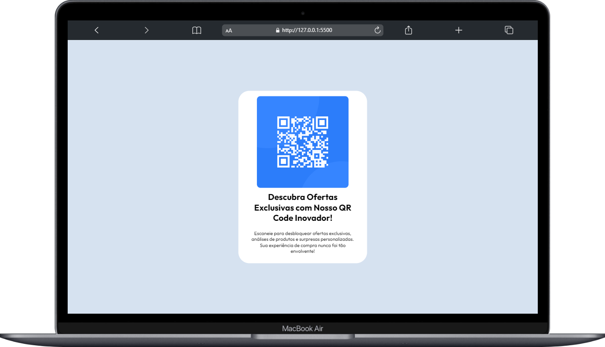
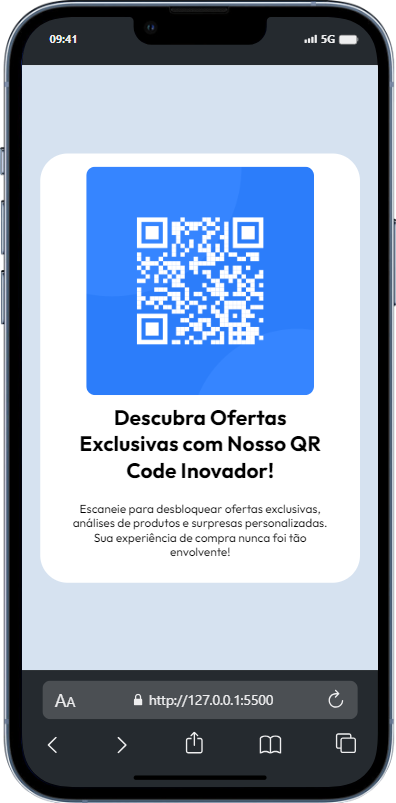

# QR Code Interativo com HTML e CSS

## Visão Geral 
Este projeto oferece uma solução simples e elegante para implementar um QR Code interativo em suas páginas da web. Ao escanear o código, os usuários podem acessar informações exclusivas, ofertas especiais e avaliações de produtos, proporcionando uma experiência de compra envolvente.

## Como Usar
1- Abra o arquivo index.html em seu navegador favorito.

2- Escaneie o QR Code exibido na página com o aplicativo de leitura de QR Code em seu dispositivo móvel.

3- Explore ofertas exclusivas, análises de produtos e muito mais

Estrutura do Projeto
index.html: Contém a estrutura HTML para a página com o QR Code.

style.css: Arquivo CSS que estiliza a página e o QR Code.

img: Pasta que armazena as imagens, incluindo o ícone do QR Code.

## Images do Projeto

 
 
 

## Personalização
Sinta-se à vontade para personalizar o conteúdo do QR Code e o design da página de acordo com suas necessidades. O código HTML está projetado para ser facilmente adaptado, e as folhas de estilo CSS podem ser ajustadas para refletir a identidade visual da sua marca.

## Tecnologias Utilizadas
- HTML5

- CSS3

## Contribuição
Contribuições são bem-vindas! Se você encontrar bugs ou tiver sugestões de melhorias, sinta-se à vontade para abrir uma issue ou enviar um pull request.

### Esperamos que este QR Code interativo aprimore a experiência dos seus usuários e adicione um toque inovador às suas páginas da web! Se tiver dúvidas ou precisar de suporte, não hesite em entrar em contato.

## Contato

### me segue nas redes abaixo!
 

 
  
  
  
  

